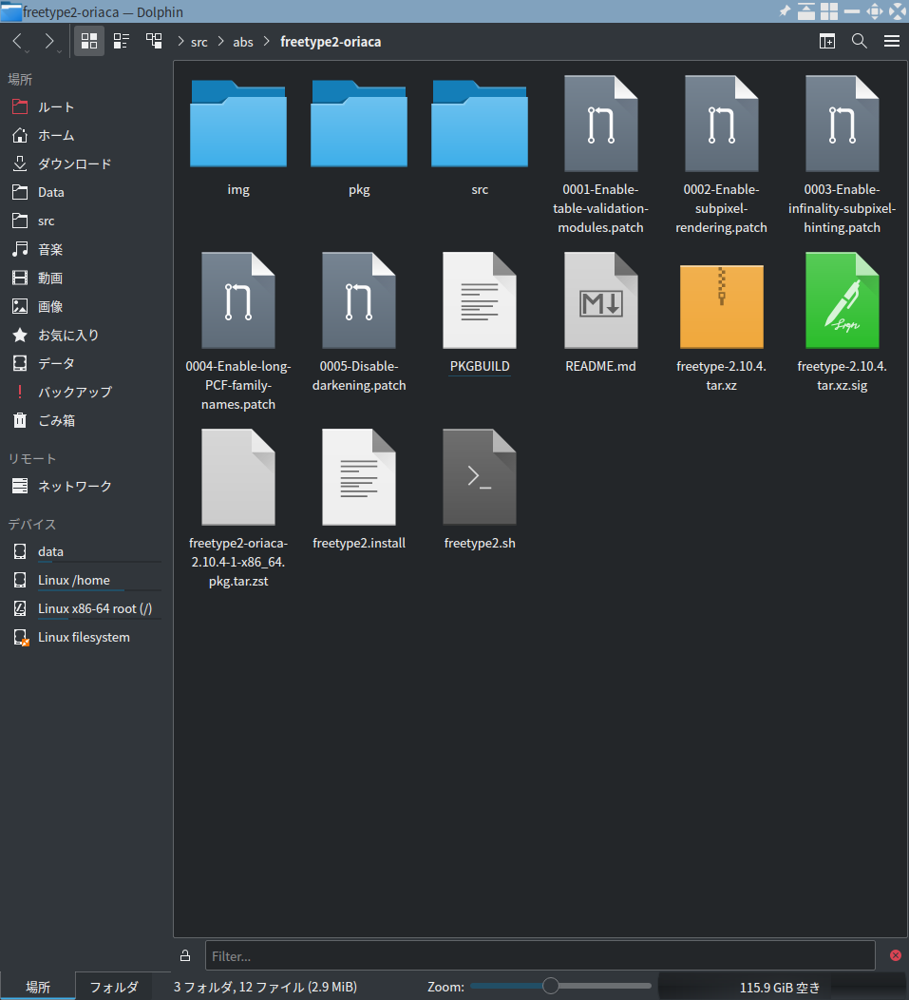

# Qtのフォントの描画が太すぎるのをどうにかするFreeType2のパッチ
Qtのフォントの描画が、GTKと比べて明らかに太くてかっこ悪いのを、強引に治すFreeType2のパッチとArch Linux用のPKGBUILD

# スクリーンショット
ビフォー


アフター


# ビルドとインストール
``` bash
$ makepkg -Csfi --skippgpcheck --check
```
